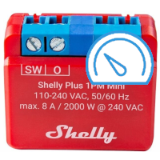
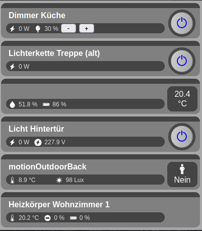

# ioBroker.vis-shelly

**Tests:** 

## vis-shelly adapter for ioBroker

A VIS adapter for display Shelly devices

## Developer manual

With the help of this adapter it should be possible to easily display and control all Shelly devices in plain sight. 

So far it is possible to display all Shelly devices or to divide the devices into rooms. 

  The project is still in its early stages and is not stable  

Devices supported so far

    Dimmer 2 
    Motion 2 
    PlugS 
    PlugS Plus 
    1PM Plus 
    2PM Plus 
    plusht 
    TRV

## Changelog

### **WORK IN PROGRESS**

-   Test for release

### 0.0.5 (2024-01-24)

-   Test for release

### 0.0.4-alpha.3 (2024-01-24)

<!--
    Placeholder for the next version (at the beginning of the line):
    ### **WORK IN PROGRESS**
-->

### 0.0.4-alpha.2

-   Romms are now editable in Admin

### 0.0.4-alpha.1

-   testing only

### 0.0.4-alpha.0 (2024-01-02)

-   (Kollos2k) initial release

## License

MIT License

Copyright (c) 2024 Kollos2k <kollos@vorsicht-bissig.de>

Permission is hereby granted, free of charge, to any person obtaining a copy
of this software and associated documentation files (the "Software"), to deal
in the Software without restriction, including without limitation the rights
to use, copy, modify, merge, publish, distribute, sublicense, and/or sell
copies of the Software, and to permit persons to whom the Software is
furnished to do so, subject to the following conditions:

The above copyright notice and this permission notice shall be included in all
copies or substantial portions of the Software.

THE SOFTWARE IS PROVIDED "AS IS", WITHOUT WARRANTY OF ANY KIND, EXPRESS OR
IMPLIED, INCLUDING BUT NOT LIMITED TO THE WARRANTIES OF MERCHANTABILITY,
FITNESS FOR A PARTICULAR PURPOSE AND NONINFRINGEMENT. IN NO EVENT SHALL THE
AUTHORS OR COPYRIGHT HOLDERS BE LIABLE FOR ANY CLAIM, DAMAGES OR OTHER
LIABILITY, WHETHER IN AN ACTION OF CONTRACT, TORT OR OTHERWISE, ARISING FROM,
OUT OF OR IN CONNECTION WITH THE SOFTWARE OR THE USE OR OTHER DEALINGS IN THE
SOFTWARE.
